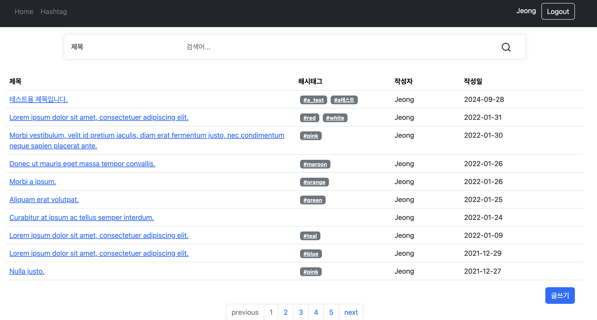
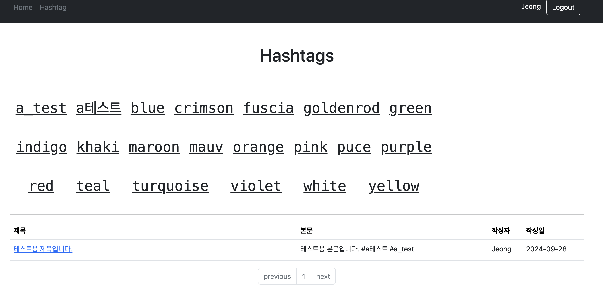
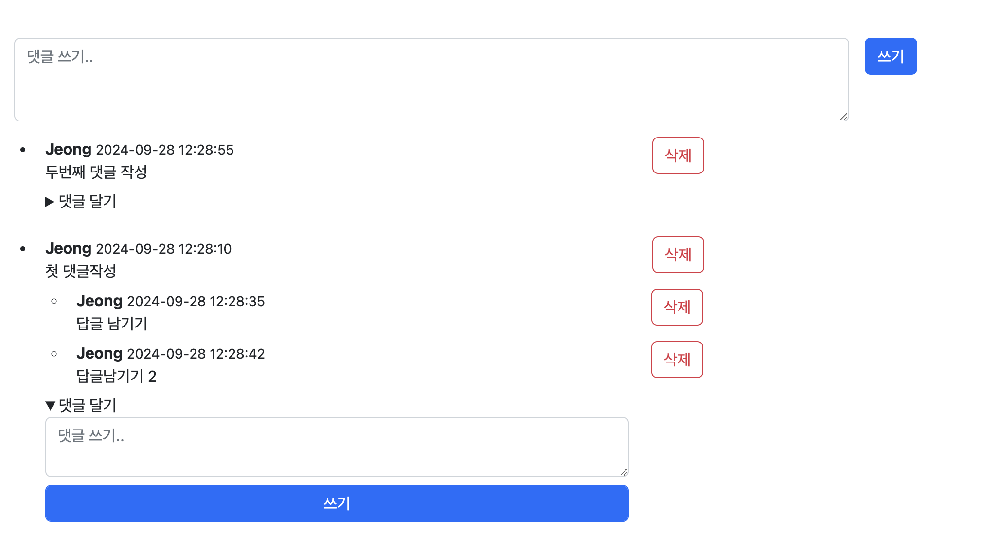
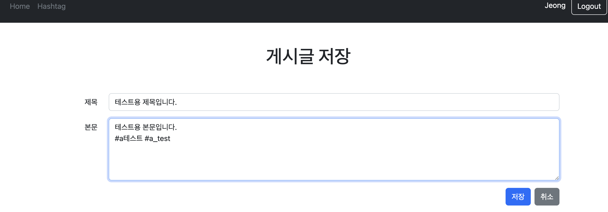
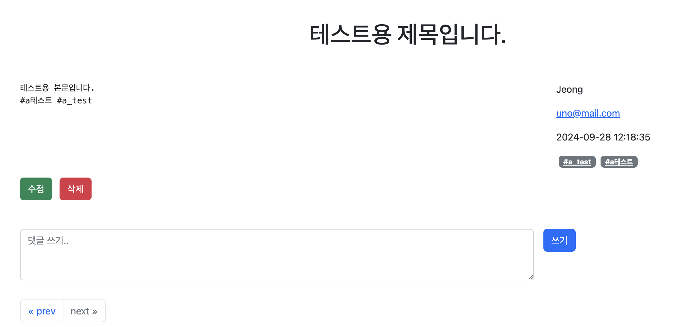
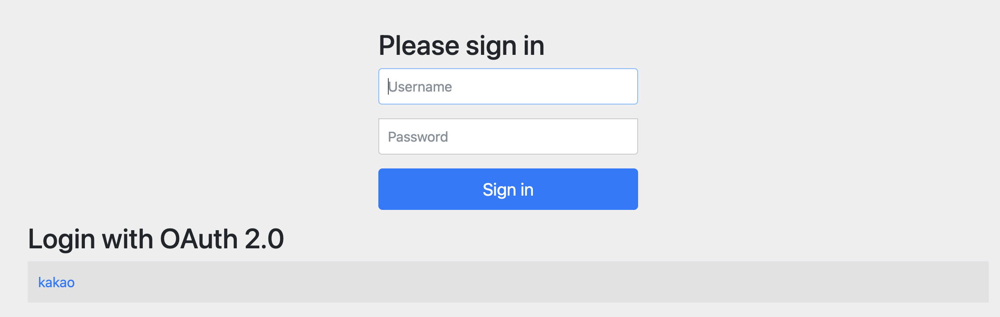
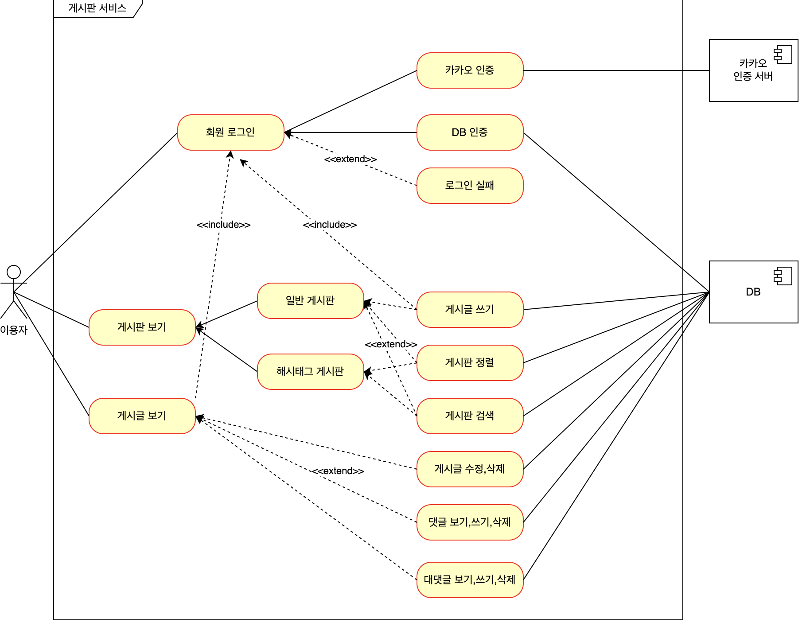
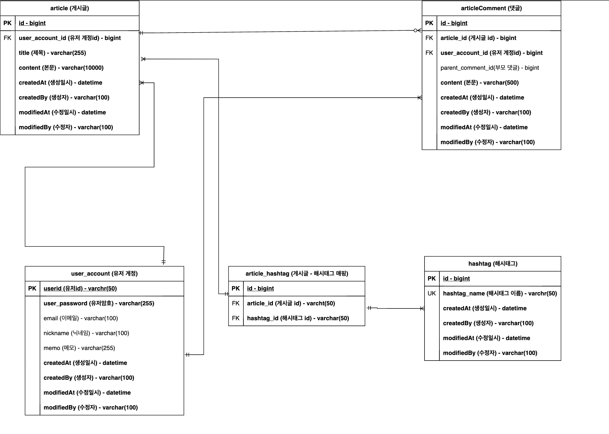
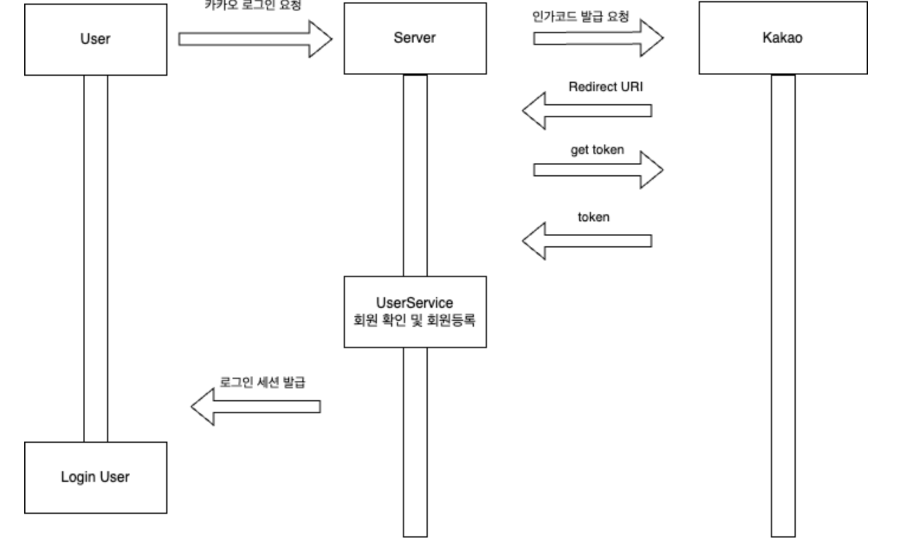

# Board Project
### 기능

- 간단한 게시판 기능을 제공합니다
- 해시태그(#)을 달 수 있고, 해시태그별로 게시글 조회할 수 있습니다.
- 댓글및 답댓글 기능을 제공합니다
- 기본 로그인과 kakao 로그인을 할 수 있습니다.

### 메인

- 작성된 게시글을 paging 하여 제공합니다.
- 제목/본문/유저ID/닉네임/해시태그 로 게시글을 검색 할 수있습니다.



### 해시태그

- 본문에 작성된 해시태그(#)가 있다면, 해시태그를 저장합니다.
- 저장된 모든 해시태그를 확인할 수 있습니다.
- 해시태그별로 게시글을 모아서 볼 수 있습니다.



### 댓글



### 게시글





### 로그인



## Project Structure

---

### 개발환경

- IntelliJ IDEA Ultimate 2023.1.2
- Java 17
- Gradle 7.4.1
- Spring Boot 2.7.0

### 기술 스택

- Spring Boot
- Spring Data JPA & QueryDSL
- Rest Repositories & HAL Explorer
- Thymeleaf
- Spring Security & OAuth 2.0
- H2 Database
- MySQL
- Lombok

### Use-case

---



### ERD

---



## Spring Boot(Web Server)

---

- config : Project configuration을 관리한다.
- controller : 요청받은 내용을 비지니스로직에 전달하고, 결과 데이터를 모델에 담는다.
- domain : 실제 DB의 테이블과 매핑되는 객체를 정의한다.
- dto : 계층간 데이터 교환을 위한 request/response dto 를 관리한다.
    - security 에 사용할 Principal, OAuth2.0 를 사용하기위한 Dto를 포함한다.
- repository : domain과 JPA/QueryDSL 을 관리한다.
- service : 비지니스 로직을 관리한다.

## Spring Security

---

- WebSecurityCustomizer 로 css, javascript 같은 StaticResource 권한 체크를 ignore 하면 Spring Security 의 관리를 벗어나, CSRF 같은 공격에 취약해 질 수 있기 때문에 StaticResourceLocation 를 사용하여 Spring Security 의 관리하에 동작할 수있도록 했습니다.
- 삭제 및 수정이 일어나지않는 GET 메소드를 제외한 요청은 권한 체크를 하도록 했습니다.
    - 전체 게시글 조회, 해시태그 조회기능은 모든 요청에 permiAll 하도록 선언했습니다.
- TestSecurityConfig 정의하여 Security 와 테스트를 독립적으로 테스트 할 수 있도록 했습니다.
- 인증되지않은 유저와 인증된 유저의 동작 방식이 다르기때문에 두 가지 요청을 테스트 했습니다.

## JPA & QueryDSL

---

- JPA : DB의 CRUD 작업을 간단히 수행할 수 있도록 사용했습니다.
- QueryDSL : Join 과 같은 SQL 을 QueryDSL로 작성했습니다.

### 구조

- ArticleRepository (JPA Interface)
- ArticleRepositoryCustom (QueryDSL Interface)
- ArticleRepositoryCustomImpl (QueryDSL Implements Class)

## OAuth2.0

---

- 기본 OAuth 2.0 인증 구현체를 사용했습니다.
- 카카오 인증 정보를 회원으로 등록했습니다.



## JUnit (Test) & TDD

---

> 테스트하고자하는 Target 에 집중하기위해 계층 별로 Bean 등록을 최소화 했습니다.
>

> 총 103 개의 테스트 코드를 정의했습니다.
>
- 기능 개발전에, 테스트코드를 먼저 작성하며 기능수행을 위해 필요한 정보를 파악 했습니다.
- BDDMockito 를 사용하여 Given, When, Then 구조로 테스트코드의 가시성을 높였습니다.

### config

- TestSecurityConfig 를 사용하여 Auditing 기능을 사용하고, 테스트에 필요한 인증을 간소화 하여 테스트의 편의성을 높였습니다.

### controller

- 모든 Bean 올려 테스트를 하면 테스트가 무거워지고, Target 의 주요 기능 테스트에 집중하기 어렵기때문에 Target Controller 를 제외한 부분은 Mocking 했습니다.
- 인증된 유저와 미인증 유저는 각각 다르게 동작해야 하므로 인증만 필요하면 @WithMockUser 어노테이션을 사용하였고, 인증 정보를 포함해야 한다면 @WithUserDetails 어노테이션을 사용하였습니다.

```java
@DisplayName("View 컨트롤러 - 게시글")
@Import({TestSecurityConfig.class, FormDataEncoder.class})
@WebMvcTest(ArticleController.class)
class ArticleControllerTest {

    private  final MockMvc mvc;
    private final FormDataEncoder formDataEncoder;

    @MockBean private ArticleService articleService;
    @MockBean private PaginationService paginationService;
...
}
```

### Repository

- JPA 기능 뿐만아니라, 커스텀하게 작성한 QueryDSL 메소드를 테스트 했습니다.
- @DataJpaTest 어노테이션을 통해 Repository 에 대한 Bean 만 등록했습니다.

```java
@DisplayName("JPA 연결 테스트")
@Import(JpaRepositoryTest.TestJpaConfig.class)
@DataJpaTest
class JpaRepositoryTest {
	...
}
```

### Service

- 테스트시 중요관점이 아닌 부분은 Mocking 하여 외부 의존성을 줄였습니다.

```java
@DisplayName("비즈니스 로직 - 게시글")
@ExtendWith(MockitoExtension.class)
class ArticleServiceTest {

    @InjectMocks private ArticleService sut;

    @Mock private HashtagService hashtagService;
    ...
}
```

## 개선 사항

---

### 복합인덱스로 성능 개선

> 데이터가 많아질수록, 마이페이지의 읽기 속도가 저하되는것을 발견했습니다.
>
- 기존 : created_at 단일 인덱스를 사용하던 방식
- 개선 후 : user_id, created_at 복합인덱스로 인덱스를 추가
- 유저 500명, 데이터 100만건 기준으로 실제로 데이터를 넣은뒤 성능 비교를 해봤습니다.
- 조회 속도 45% 개선

### 테스트 환경

- 유저 500명, 게시글 100만 건을 기준
- 마이페이지는 본인 id 로 조회하고(WHERE), 작성일자 기준 최신순으로 정렬(ORDER BY) 해야합니다.

### created_at

- 약 174 ms


### created_at, user_id 복합인덱스

- 약 148 ms


### user_id, created_at 복합인덱스

- 약 116 ms
- created_at, user_id 순서대비 약 26% 성능 개선


> 복합 인덱스 적용 후
45**% 속도 개선**
>

## 성능 개선을 하며 알게된 내용

### 복합인덱스 컬럼 선정 조건

- 하나의 컬럼만으로는 분포도가 높을 수 있지만, 여러개의 컬럼으로 분포도가 낮추면 효율이 높아질 수 있다.
- 복합 인덱스 생성 조건
    - WHERE 조건으로 사용되는 컬럼
    - 조인 절에 연결고리로서 사용되는 컬럼
    - ORDER BY 절에서 사용되는 컬럼

### 복합인덱스 컬럼의 결합 순서의 차이

A + B + C 순서로 생성한다면 A에 대한 정렬을 한뒤, B를 정렬하고, C를 정렬한다.

A를 먼저 찾고 B를 찾은 후 C를 찾아야 하기때문에, B나 C를 먼저 정렬한 것 하고는 차이가 있다.

> 복합인덱스 컬럼 순서 선택시 고려 할 점.
>
1. 공통적으로 사용하는 조건절 컬럼을 우선한다.
2. ‘=’ 조건의 컬럼을 다른 연산자 컬럼보다 우선한다.
3. 대분류 → 중분류 → 소분류 컬럼순으로 구성한다.
4. WHERE 조건절 컬럼은 ORDER BY 조건절 컬럼보다 우선한다.

### 인덱스 설정 시 주의 할점

데이터 쓰기를 했을 때 100만건 기준 약 36% 속도 저하를 확인했습니다.

> 인덱스 선택시 고려해야 할 점
>
- 데이터의 변경이 잦은 컬럼에는 인덱스 사용하지 않아야한다.
    - 인덱스로 지정된 컬럼의 값이 바뀌게 되면 인덱스 테이블이 갱신되어야 하므로 속도가 저하 할 수 있다.
- 인덱스 설정 시, 데이터베이스에 할당된 메모리를 사용하여 테이블 형태로 저장된다.
    - 인덱스가 많아지면 데이터베이스의 메모리를 많이 잡아먹게 된다.
- 읽기의 빈도가 많을수록, 쓰기의 빈도가 적을수록 유용하다.